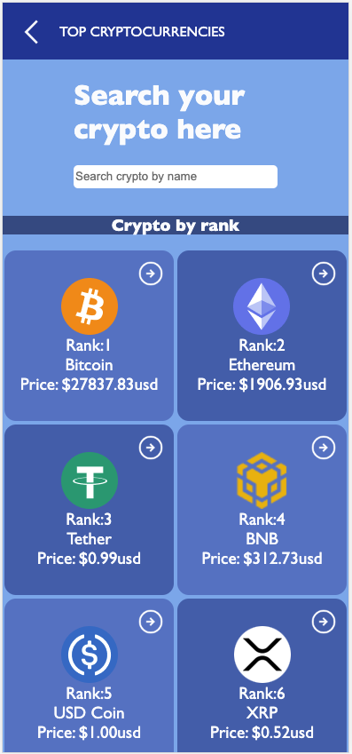
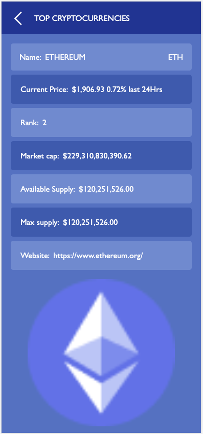

<!-- TABLE OF CONTENTS -->

  
# 📗 Table of Contents
 

- [📖 About the Project](#about-project)
  - [🛠 Built With](#built-with)
    - [Tech Stack](#tech-stack)
    - [Key Features](#key-features)
  - [🚀 Live Demo](#live-demo)
- [💻 Getting Started](#getting-started)
  - [Setup](#setup)
  - [Prerequisites](#prerequisites)
  - [Install](#install)
  - [Usage](#usage)
  - [Run tests](#run-tests)
  - [Deployment](#deployment)
- [👥 Authors](#authors)
- [🔭 Future Features](#future-features)
- [🤝 Contributing](#contributing)
- [⭐️ Show your support](#support)
- [🙏 Acknowledgements](#acknowledgements)
- [❓ FAQ](#faq)
- [📝 License](#license)

# Metrics Cryptocurrencies 

Welcome Metrics Criptocurrencies
This project is a SPA (single-page application) Where you can see the top 100 ranked cryptocurrencies and search them by name.
This app fetches data from [API](https://documenter.getpostman.com/view/5734027/RzZ6Hzr3?version=latest#intro).

## Mobile

## 🛠 Built With 

### Tech Stack 

    
Client

    <ul>
        <li><a href="https://es.react.dev/">React</a></li>
        <li><a href="https://redux.js.org/">Redux</a></li>
        <li><a href="https://jestjs.io/">Jest (Testing)</a></li>
    </ul>

<!-- Features -->

### Key Features 

- **[Home Page]**
- **[Details Page]**
- **[Sort functionality]**

(<a href="#readme-top">back to top</a>)

<!-- LIVE DEMO -->

## 🚀 Live Demo 

- [Live Demo](https://metrics-cryptocurrency-v2.netlify.app/)

(<a href="#readme-top">back to top</a>)

<!-- GETTING STARTED -->

## 💻 Getting Started 

### Setup

Clone this repository to your desired folder.

### Prerequisites

In order to run this project you need:
- Visual Studio Code
- Git
- Npm
- Node
- React
- Jest

(<a href="#readme-top">back to top</a>)

### Install

Amongisde the prerequisites, you will need to install the following dependencies: 
- react-redux
- redux toolkit
- jest
- babel
- react-dom
- react-router and react-router-dom

All of these dependencies can be installed using command "npm install".

(<a href="#readme-top">back to top</a>)

### Usage 

To run the project, execute the following command in your terminal (inside the project folder):

- npm install
- npm start

(<a href="#readme-top">back to top</a>)

### Run Tests 

To run the the tests, you will have to run the following command in the console (inside the project folder): 

- npm install

And then you will have to run the following command in the console (inside the project folder): 

- npm test

You will see the outcome in the console

(<a href="#readme-top">back to top</a>)

### Deployment 

To deploy this project in a local enviroment, you will have to run:

- npm start

(<a href="#readme-top">back to top</a>)

<!-- AUTHORS -->

## 👥 Author <a name="authors">Jesus Molina</a>

- GitHub: [@Sparktan24](https://github.com/Sparktan24)
- Twitter: [@Sparktan1](https://twitter.com/Sparktan1)
- LinkedIn: [Jesus Molina](https://www.linkedin.com/in/jesus-molina-2b104424a/)

(<a href="#readme-top">back to top</a>)

<!-- FUTURE FEATURES -->

## 🔭 Future Features 

- [ ] **[Finishing the full website]**
- [ ] **[Adding sort buttons]**

(<a href="#readme-top">back to top</a>)

<!-- Project Presentation -->

## :movie_camera: Project Presentation 

- [Presentation](https://www.loom.com/share/9d312e44c1ff449298a860f146591255)

(<a href="#readme-top">back to top</a>)

<!-- CONTRIBUTING -->

## 🤝 Contributing 

Contributions, issues, and feature requests are welcome!

Feel free to check the [issues page](https://github.com/Sparktan24/metrics-webapp-cryptocurrency-v2/issues).

(<a href="#readme-top">back to top</a>)

<!-- SUPPORT -->

## ⭐️ Show your support 

If you like this project feel free to let me know via Linkedin - Github - Twitter, also don't forget to leave your ⭐️. I will always appreciate your comments.

(<a href="#readme-top">back to top</a>)

<!-- ACKNOWLEDGEMENTS -->

## 🙏 Acknowledgments 

- Design for dis project is inspired by [Nelson Sakwa](https://www.behance.net/gallery/31579789/Ballhead-App-(Free-PSDs)).
- API used for the data [Public API](https://documenter.getpostman.com/view/5734027/RzZ6Hzr3?version=latest#intro).

(<a href="#readme-top">back to top</a>)

<!-- LICENSE -->

## 📝 License 

This project is [MIT](./LICENSE) licensed.

(<a href="#readme-top">back to top</a>)

